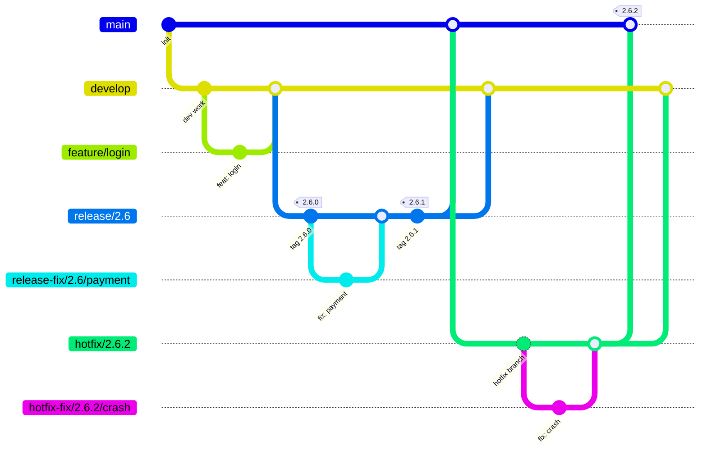
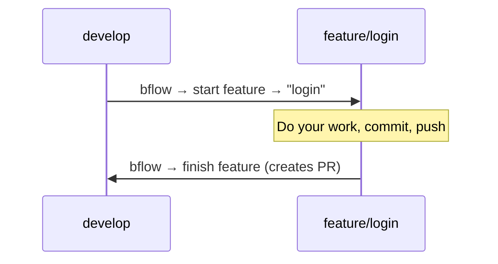
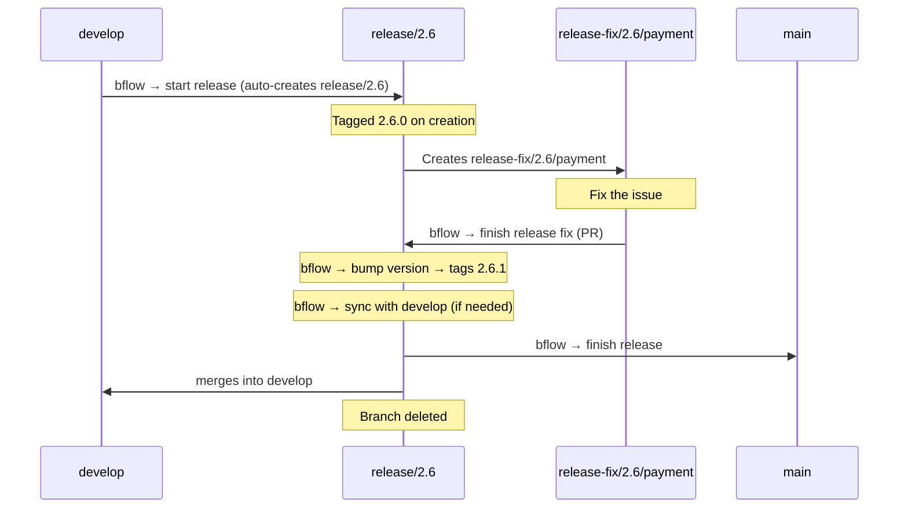
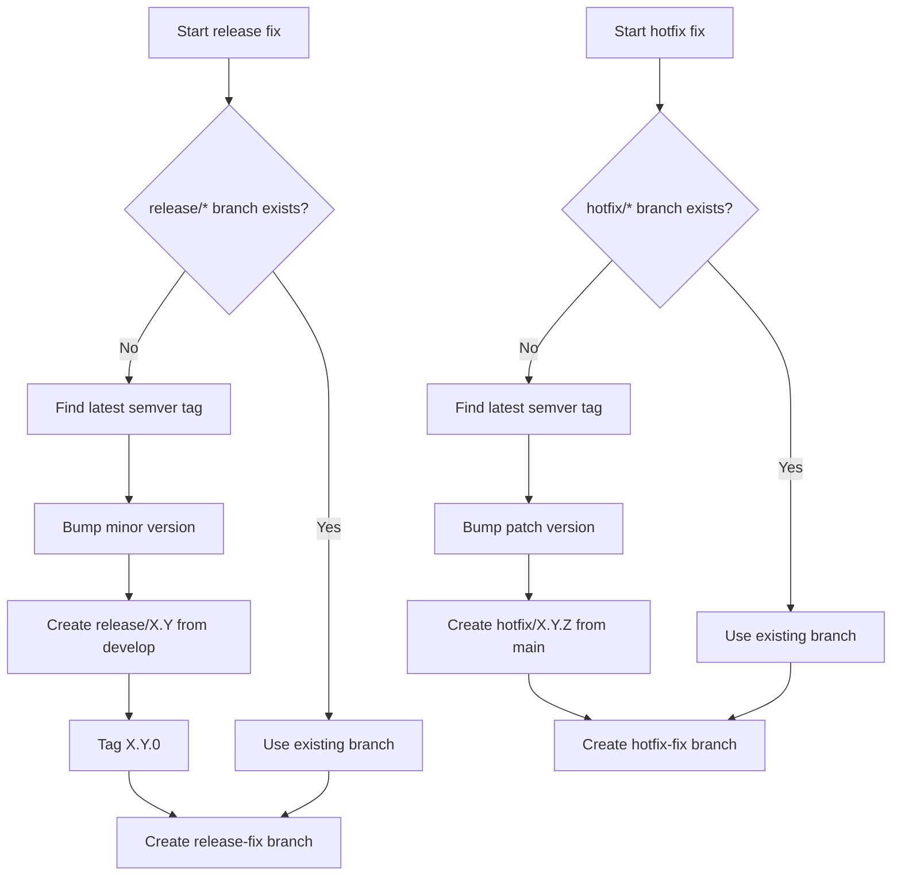

# bflow — Beans GitFlow CLI

A cross-platform CLI tool that implements the Beans customized gitflow workflow. It detects your current git branch, presents context-appropriate options, and handles all the branching, merging, tagging, and PR creation for you.

## Installation

### Homebrew (macOS)

```bash
brew tap Beans-BV/tap
brew install bflow
```

### Chocolatey (Windows)

```powershell
choco install bflow
```

### Pre-built binaries

Download the latest release from the [GitHub Releases](https://github.com/Beans-BV/beans-gitflow/releases) page.

### From source

```bash
cargo install --path .
```

### Requirements

- [git](https://git-scm.com/)
- [gh](https://cli.github.com/) (GitHub CLI, authenticated via `gh auth login`)

## Branch Model

bflow manages two permanent branches and several short-lived branch types:



### Branch Types

| Branch | Created from | Merges into | Purpose |
|--------|-------------|-------------|---------|
| `main` / `master` | — | — | Production code |
| `develop` | — | — | Integration branch |
| `feature/{name}` | `develop` | `develop` (PR) | New functionality |
| `fix/{name}` | `develop` | `develop` (PR) | Bug fixes |
| `chore/{name}` | `develop` | `develop` (PR) | Maintenance & tooling |
| `docs/{name}` | `develop` | `develop` (PR) | Documentation |
| `refactor/{name}` | `develop` | `develop` (PR) | Code restructuring |
| `release/{major}.{minor}` | `develop` | `main` + `develop` | Release preparation |
| `release-fix/{v}/{name}` | `release/{v}` | `release/{v}` (PR) | Fixes during release |
| `hotfix/{major}.{minor}.{patch}` | `main` | `main` + `develop` | Urgent production fix |
| `hotfix-fix/{v}/{name}` | `hotfix/{v}` | `hotfix/{v}` (PR) | Fixes during hotfix |

## How It Works

Run `bflow` in any git repository. The tool detects your current branch and shows the appropriate menu.

### On `develop`

```
? What would you like to do?
> start feature
  start fix
  start chore
  start docs
  start refactor
  start release
```

### On `main`

```
? What would you like to do?
> start hotfix fix
```

### On a work branch (feature, fix, chore, docs, refactor)

```
? What would you like to do?
> finish {type}
  start feature
  start fix
  start chore
  start docs
  start refactor
```

Selecting finish creates a PR back to the base branch. You can also start a new branch from the current branch or from `develop`.

### On `release/{v}`

```
? What would you like to do?
> finish release
  start release fix
  bump version
  sync with develop
```

### On `release-fix/{v}/{name}`

```
? What would you like to do?
> finish release fix
```

### On `hotfix/{v}`

```
? What would you like to do?
> finish hotfix
```

### On `hotfix-fix/{v}/{name}`

```
? What would you like to do?
> finish hotfix fix
```

## Workflows

### Feature / Fix / Chore / Docs / Refactor

Simple workflow for day-to-day work:



### Release

Releases are tagged for deployment. Build agents auto-deploy based on tags.



#### Release commands

| Command | What it does |
|---------|-------------|
| **bump version** | Auto-increments patch from latest tag (2.6.0 → 2.6.1 → 2.6.2) |
| **sync with develop** | Merges release changes into `develop` for fixes needed immediately |
| **finish release** | Merges into `main` + `develop`, cleans up branch |

### Hotfix

For urgent production fixes:


## Version Resolution

When starting a release-fix or hotfix-fix, bflow automatically resolves the integration branch:



## Commit Convention

All commits and PR titles generated by bflow follow [Conventional Commits](https://www.conventionalcommits.org/):

| Branch type | PR title format |
|------------|----------------|
| `feature/{name}` | `feat: {name}` |
| `fix/{name}` | `fix: {name}` |
| `chore/{name}` | `chore: {name}` |
| `docs/{name}` | `docs: {name}` |
| `refactor/{name}` | `refactor: {name}` |

Merge commits and tags also follow the convention:
- `chore: create release branch 2.6`
- `chore: bump version to 2.6.1`
- `chore: finish release 2.6` (merge into main)
- `chore: merge release 2.6 into develop`
- `chore: sync release 2.6 with develop`
- `chore: finish hotfix 2.5.4` (merge into main)
- `chore: hotfix 2.5.4` (tag message)
- `chore: merge hotfix 2.5.4 into develop`

## Architecture

```
src/
├── main.rs              — Entry point, preflight checks, dispatch
├── lib.rs               — Library root, re-exports all modules
├── git/
│   ├── mod.rs           — Git trait + CLI implementation
│   └── branch.rs        — Branch type detection and parsing
├── hosting/
│   ├── mod.rs           — Hosting platform trait
│   └── github.rs        — GitHub implementation via gh CLI
├── flows/
│   ├── start.rs         — Start work/release-fix/hotfix-fix
│   ├── finish_work.rs   — PR creation for work branches
│   ├── finish_release.rs — Bump, sync, finish release
│   └── finish_hotfix.rs — Finish hotfix with auto-tag
├── version.rs           — SemVer parsing and bumping
└── menu.rs              — Interactive menus via crossterm
```

The `Git` and `HostingPlatform` traits enable future extensibility (e.g. GitLab, Bitbucket) and testability.

## License

[Apache 2.0](LICENSE)
