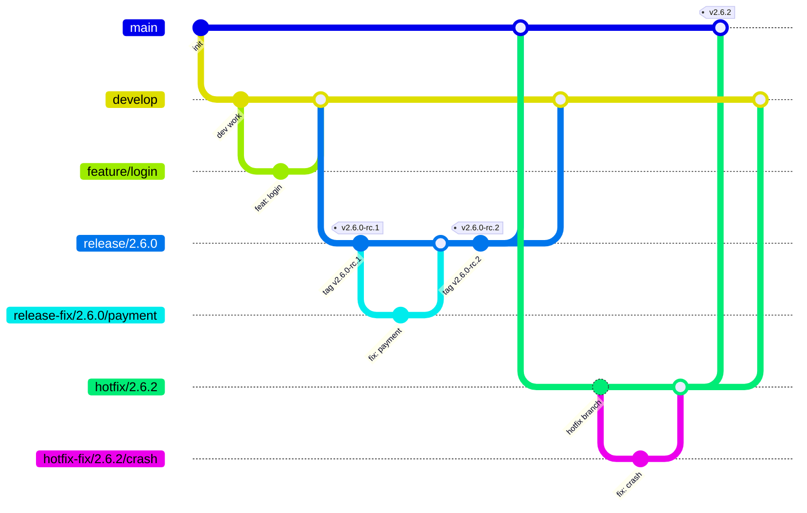
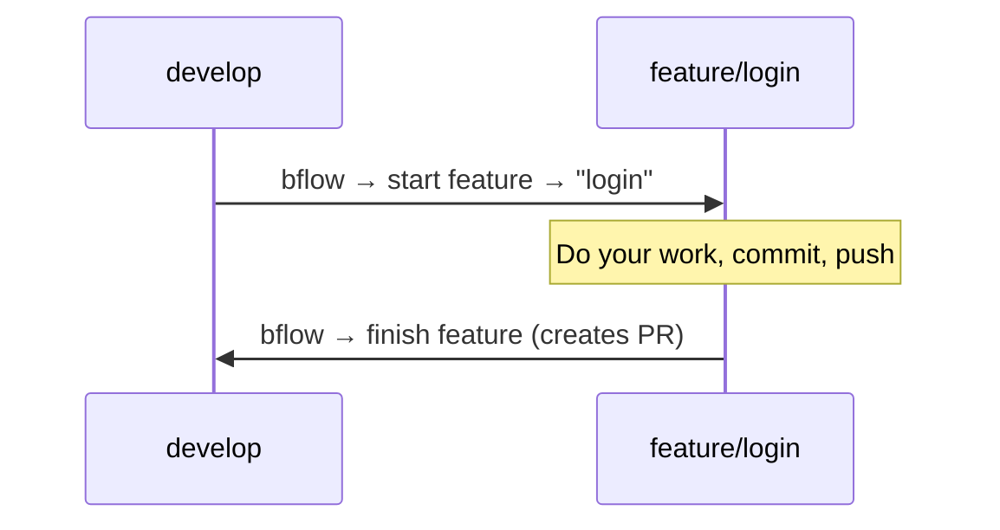
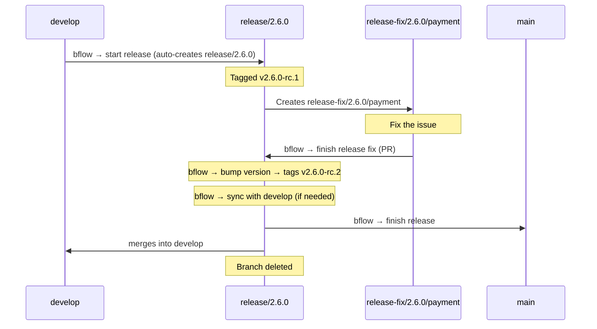
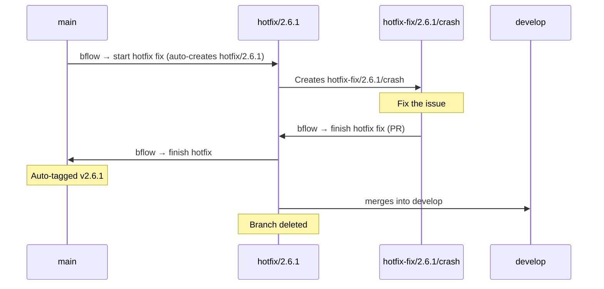
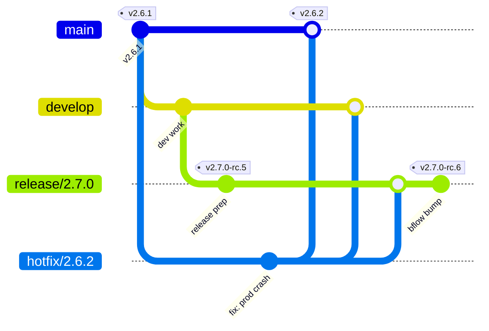
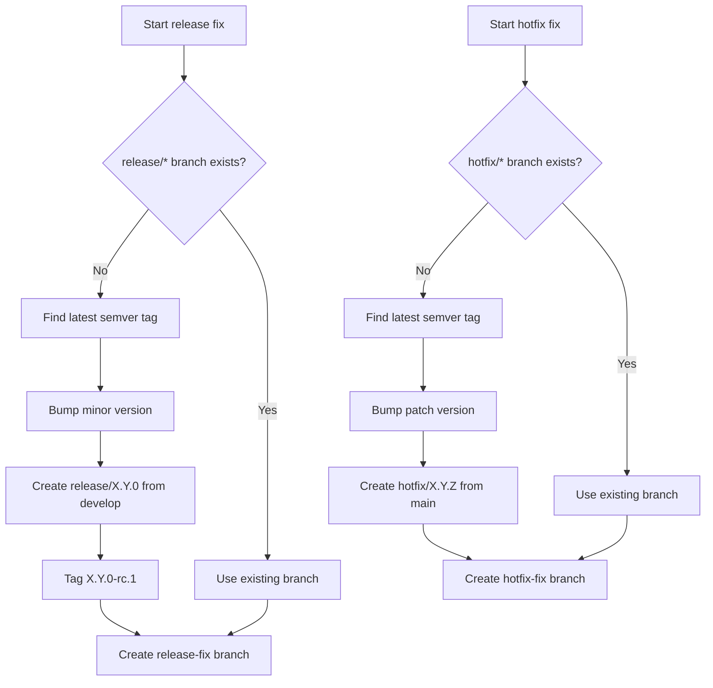
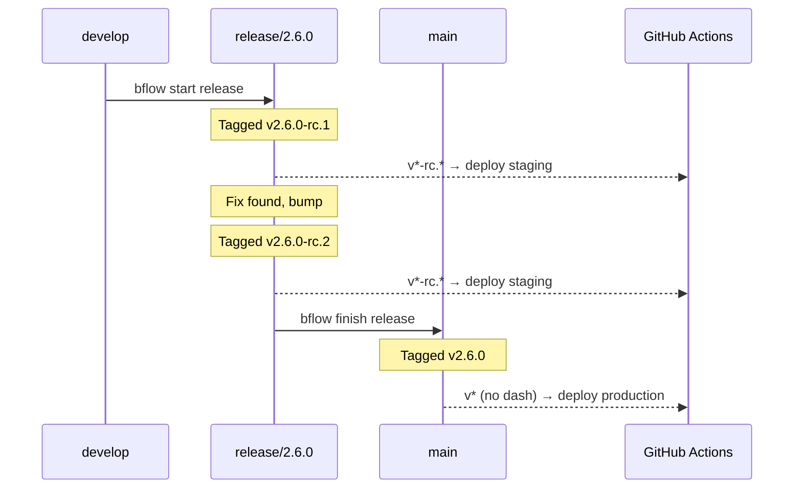

# bflow — Beans GitFlow CLI

A cross-platform CLI tool that implements the Beans customized gitflow workflow. It detects your current git branch, presents context-appropriate options, and handles all the branching, merging, tagging, and PR creation for you.

## Installation

### Homebrew (macOS)

```bash
brew tap Beans-BV/tap
brew install bflow
```

### Chocolatey (Windows)

```powershell
choco install bflow
```

### Pre-built binaries

Download the latest release from the [GitHub Releases](https://github.com/Beans-BV/beans-gitflow/releases) page.

### From source

```bash
cargo install --path .
```

### Requirements

- [git](https://git-scm.com/)
- For GitHub repos: [gh](https://cli.github.com/) (GitHub CLI, authenticated via `gh auth login`)
- For Azure DevOps repos: [az](https://learn.microsoft.com/cli/azure/) (Azure CLI) with the `azure-devops` extension (`az extension add --name azure-devops`), authenticated via `az login` or a PAT via `az devops login`

### Hosting provider

bflow auto-detects the hosting provider from the `origin` remote URL: `dev.azure.com` and `*.visualstudio.com` remotes use Azure DevOps (org/project/repo are parsed from the URL), everything else uses GitHub. Only the CLI of the detected provider needs to be installed.

To override detection (e.g. a GitHub Enterprise domain), set:

```bash
git config bflow.hosting.provider github   # or: devops (requires an Azure DevOps origin URL)
```

## Branch Model

bflow manages two permanent branches and several short-lived branch types:



### Branch Types

| Branch | Created from | Merges into | Purpose |
|--------|-------------|-------------|---------|
| `main` / `master` | — | — | Production code |
| `develop` | — | — | Integration branch |
| `feature/{name}` | `develop` | `develop` (PR) | New functionality |
| `fix/{name}` | `develop` | `develop` (PR) | Bug fixes |
| `chore/{name}` | `develop` | `develop` (PR) | Maintenance & tooling |
| `docs/{name}` | `develop` | `develop` (PR) | Documentation |
| `refactor/{name}` | `develop` | `develop` (PR) | Code restructuring |
| `release/{major}.{minor}.{patch}` | `develop` | `main` + `develop` | Release preparation |
| `release-fix/{v}/{name}` | `release/{v}` | `release/{v}` (PR) | Fixes during release |
| `hotfix/{major}.{minor}.{patch}` | `main` | `main` + `develop` + open `release/*` | Urgent production fix |
| `hotfix-fix/{v}/{name}` | `hotfix/{v}` | `hotfix/{v}` (PR) | Fixes during hotfix |

## How It Works

Run `bflow` in any git repository. The tool detects your current branch and shows the appropriate menu.

### Uncommitted Changes

When you run `bflow start` with uncommitted changes (staged, unstaged, or untracked files), bflow automatically stashes your changes, creates the new branch, and restores them on the new branch. No flags or prompts needed — your work-in-progress follows you.

If restoring changes causes conflicts with the target branch, bflow leaves the conflicts for you to resolve manually (the stash is preserved as a safety net).

Finish commands (`bflow finish`, `bflow bump`, `bflow sync`) still require a clean working tree.

### On `develop`

```
? What would you like to do?
> start feature
  start fix
  start chore
  start docs
  start refactor
  start release
```

### On `main`

```
? What would you like to do?
> start hotfix fix
```

### On a work branch (feature, fix, chore, docs, refactor)

```
? What would you like to do?
> finish {type}
  start feature
  start fix
  start chore
  start docs
  start refactor
```

Selecting finish creates a PR back to the base branch. You can also start a new branch from the current branch or from `develop`.

### On `release/{v}`

```
? What would you like to do?
> finish release
  start release fix
  bump version
  sync with develop
```

### On `release-fix/{v}/{name}`

```
? What would you like to do?
> finish release fix
```

### On `hotfix/{v}`

```
? What would you like to do?
> finish hotfix
```

### On `hotfix-fix/{v}/{name}`

```
? What would you like to do?
> finish hotfix fix
```

## Non-Interactive CLI (for AI tools & scripts)

All commands can be invoked directly via subcommands, bypassing the interactive menu:

### Start commands

```bash
bflow start feature --name <name> [--base <branch>] [--no-checkout] [--no-worktree]
bflow start fix --name <name> [--base <branch>] [--no-checkout] [--no-worktree]
bflow start chore --name <name> [--base <branch>] [--no-checkout] [--no-worktree]
bflow start docs --name <name> [--base <branch>] [--no-checkout] [--no-worktree]
bflow start refactor --name <name> [--base <branch>] [--no-checkout] [--no-worktree]
bflow start release [--major | --minor]
bflow start release-fix --name <name> [--no-checkout] [--no-worktree]    # must be on a release branch
bflow start hotfix-fix --name <name> [--no-checkout] [--no-worktree]     # must be on main or hotfix branch
```

`--base` defaults to `develop` when omitted.

`--major` / `--minor` on `start release` skips the interactive prompt and forces the bump level. Useful for scripts and AI agents.

`--no-checkout` creates and pushes the branch without switching to it. You stay on your current branch. Designed for [git worktree](https://git-scm.com/docs/git-worktree) workflows. Not available for `start release`.

`--no-worktree` skips the optional [worktree flow](#worktree-integration) for a single command when `bflow.worktree.enabled` is set. No effect otherwise.

### Finish

```bash
bflow finish [--breaking | --breaking=false] [--base <branch>]
bflow finish --abort   # discard an in-progress release/hotfix finish
```

Infers the action from the current branch type (e.g., creates PR on work branches, merges + tags on release/hotfix branches).

On feature, fix, and refactor branches, `bflow finish` asks whether the work contains breaking changes. Pass `--breaking` (true) or `--breaking=false` to skip the prompt in non-interactive contexts. The flag is honored on any work branch type.

On work branches, the PR target is normally detected from the branch topology: when exactly one candidate parent is found it is used directly, and only when several candidates exist does a selection menu appear. Candidates are `develop` plus the work branches your branch could have come from, ranked nearest-first; work branches that were started *from* your branch are excluded, while `develop` is always offered no matter how far ahead of you it has moved. Pass `--base <branch>` to set the target explicitly and skip detection and the menu entirely — combined with `--breaking`, this makes `bflow finish` fully scriptable without a TTY (CI, AI agents). The branch must exist on origin — PRs are created on the hosting platform, so a local-only branch is rejected (push or fetch it first) — and must differ from the branch being finished. `--base` is only valid on work branches; release, hotfix, release-fix, and hotfix-fix finishes have a fixed target and reject it.

#### After the PR is merged

Re-running `bflow finish` on a work branch (or release-fix/hotfix-fix branch) whose PR has been **merged** completes the finish instead of opening a new PR: it deletes the remote branch (if the platform didn't already), deletes the local branch, and — when the branch lives in its own [worktree](#worktree-integration) — removes the worktree and tells you the editor window can be closed. Completion is detected from the hosting platform's PR state, so there is nothing to remember between runs.

Cleanup only happens when the local branch tip is exactly the commit the PR merged; if you committed more work after the merge, `bflow finish` says so and opens a fresh PR for the new commits instead. A PR that was closed without merging also leads to a new PR, never to cleanup. Outside a worktree, cleanup switches you back to the PR's target branch and fast-forwards it first.

#### Resuming after a merge conflict

`bflow finish` on **release** and **hotfix** branches is **idempotent**: if a merge into `main`, `develop`, or an open `release/*` branch conflicts, resolve the conflict in your editor and `git commit` the merge. A conflict usually leaves HEAD on the target branch (e.g. `develop`), so to continue you **switch back to the source branch and re-run `bflow finish`**:

```bash
git switch hotfix/2.5.2   # back to the branch that started the finish
bflow finish              # resumes; already-done steps are skipped
```

Steps that already completed (merges, tags, pushes, branch deletion) are detected from git state and skipped — the flow continues from the first incomplete step. The conflict message names the exact branch to switch back to.

**Resume is branch-scoped.** Each in-progress finish is tracked in its own file under `.git/bflow-finish/` (e.g. `hotfix-2.5.2.state`), keyed by the source branch. bflow only resumes when you are standing on that source branch — from `develop`, `main`, or any `feature/*` branch it behaves normally, so a stalled finish never blocks other work. Two finishes (e.g. a release and a hotfix) can be in progress at once without colliding. Use `bflow finish --abort` from the source branch to discard its in-progress state and start fresh.

#### PR templates

When `bflow finish` opens a PR, it picks the body template by branch type. Place templates in `.github/pr-templates/` named `bflow-<key>.md`. Resolution is most-specific first:

1. **Branch-specific** — `bflow-<type>.md` (e.g. `bflow-release-fix.md`)
2. **Group** — the fix family (`fix`, `release-fix`, `hotfix-fix`) shares `bflow-fix.md`; every other type's group equals its own name
3. **Default** — `bflow-default.md`
4. **Git default** — the repo's own default template, else an empty body. On GitHub: `.github/PULL_REQUEST_TEMPLATE.md` and the other paths `gh` recognizes. On Azure DevOps: `.azuredevops/pull_request_template.md` and the other ADO default paths.

| File | Applies to |
|------|-----------|
| `bflow-feature.md` | `feature/*` |
| `bflow-fix.md` | the fix family — `fix/*`, `release-fix/*`, `hotfix-fix/*` (unless overridden below) |
| `bflow-release-fix.md` | only `release-fix/*` (overrides `bflow-fix.md`) |
| `bflow-hotfix-fix.md` | only `hotfix-fix/*` (overrides `bflow-fix.md`) |
| `bflow-chore.md` / `bflow-docs.md` / `bflow-refactor.md` | `chore/*` / `docs/*` / `refactor/*` |
| `bflow-default.md` | any PR with no more specific match |

The feature is opt-in: with no `.github/pr-templates/` directory, bflow falls back to the existing git default behavior unchanged. bflow templates live in `.github/pr-templates/` on every hosting provider, including Azure DevOps.

### Release-only commands

```bash
bflow bump    # bump patch version
bflow sync    # sync release into develop
```

Both require being on a release branch.

## Worktree integration

Optionally, every new branch can be created in its own [git worktree](https://git-scm.com/docs/git-worktree) and opened in your editor, so each piece of work lives in a separate directory instead of switching the current checkout. It's off by default and uses native `git worktree` — no extra tools required.

### Enable

The quickest way is the built-in setup command — no need to remember any keys:

```bash
bflow worktree              # interactive setup: enable, pick an editor, choose a location
```

Or set options directly (handy for scripts and dotfiles):

```bash
bflow worktree enable                 # turn the flow on
bflow worktree editor cursor          # code (default) | cursor | windsurf | zed | pycharm | none | any command
bflow worktree path ~/worktrees       # where worktree folders go (default: the repo's parent)
bflow worktree status                 # show the current settings
bflow worktree disable                # turn it off
```

These write to your **global** git config by default (per-developer); add `--local` to scope a
setting to the current repository. They're a front-end over the `bflow.worktree.*` git config
keys, which you can also set by hand (`git config --global bflow.worktree.enabled true`):

| Key | Default | Meaning |
|-----|---------|---------|
| `bflow.worktree.enabled` | `false` | Turn the worktree flow on |
| `bflow.worktree.editor` | `code` | Command to open the worktree (`<editor> <path>`). Use `none` to skip opening |
| `bflow.worktree.path` | _(unset)_ | Directory to place worktree folders in (`~` is expanded). Defaults to the repo's parent directory |

The editor accepts any command whose CLI opens a folder as `<command> <path>` — VS Code (`code`),
Cursor (`cursor`), Windsurf (`windsurf`), Zed (`zed`), and JetBrains launchers
(`idea` / `pycharm` / `webstorm` / …) all work once their shell command is on your `PATH`.

### What it does

When enabled, `bflow start feature/fix/chore/docs/refactor` (and `release-fix` / `hotfix-fix`) will:

1. Create and push the branch **without** switching your current checkout.
2. Add a git worktree for it.
3. Open that folder in your editor (unless `editor = none`). An editor that isn't installed is a warning, not a failure — the worktree is still ready.

Pass `--no-worktree` to skip the flow for a single command. `start release` is never run through the worktree flow.

As with `--no-checkout`, an active worktree flow relaxes the branch-type check for `release-fix` and `hotfix-fix` — the target release/hotfix branch is discovered automatically, so you can run them from any branch.

### Naming & layout

Worktree folders are flat siblings of the repo (or live under `bflow.worktree.path`), each named `<repo-name>-<branch-with-slashes-as-dashes>` so the folder's own name tells you which repo and branch it is:

```
Projects/beans/
├── beans-gitflow/                              # main checkout (stays on develop/main)
├── beans-gitflow-feature-login/                # worktree for feature/login
├── beans-gitflow-fix-auth-bug/                 # worktree for fix/auth-bug
└── beans-gitflow-release-fix-1.2.0-null-crash/ # worktree for release-fix/1.2.0/null-crash
```

## Workflows

### Feature / Fix / Chore / Docs / Refactor

Simple workflow for day-to-day work:



### Release

Releases are tagged for deployment. Build agents auto-deploy based on tags.



#### Release commands

When starting a release, bflow scans commits since the last release for breaking changes and preselects major or minor accordingly. A commit is considered breaking if its title has `!` before the colon (e.g. `feat!: drop legacy API`, `refactor(auth)!: rewrite`), or if the body contains a line starting with `BREAKING CHANGE:` or `BREAKING-CHANGE:` (case-insensitive, per [Conventional Commits](https://www.conventionalcommits.org/)).

When finishing a feature, fix, or refactor branch, bflow asks whether the work contains breaking changes. If yes, the PR title gets a `!` suffix (e.g. `feat!: name`) so the signal carries into the commit history and gets picked up at the next release. For non-interactive use (scripts, CI, AI agents), pass `--breaking` (true) or `--breaking=false` to skip the prompt.

| Command | What it does |
|---------|-------------|
| **bflow bump** | Creates next RC tag (v2.6.0-rc.1 → v2.6.0-rc.2) |
| **bflow sync** | Merges release changes into `develop` for fixes needed immediately |
| **bflow finish** | Creates clean production tag (v2.6.0), merges into `main` + `develop`, cleans up branch |

> **RC-head guard:** `bflow finish` on a release branch is rejected if HEAD has commits past the latest RC tag. Every commit merged to `main` must have been validated on staging via an RC deploy. If the guard fires, run `bflow bump` to cut the next RC, wait for staging to pass, then `bflow finish`.

### Hotfix

For urgent production fixes:



#### Hotfix while a release is in flight

When a hotfix is finished and a `release/*` branch is open, bflow also propagates the fix into every open release branch (after `main` and `develop`, before cleanup). Without this, the upcoming release would ship a tree that was never validated on staging in its final form — staging deployed the release without the hotfix, and the release-into-main merge would produce a combined tree at production-tag time that no RC ever covered.



The hotfix lands on `main` (production-tagged `v2.6.2`), `develop`, *and* `release/2.7.0`. Because the release branch advances past its previous RC tag, `bflow finish` on the release will refuse to run until the operator runs `bflow bump` to cut `v2.7.0-rc.6` — at which point staging redeploys the *combined* code, so the eventual `v2.7.0` production tag is validated end-to-end. This is the same RC-head guard that protects every release path: production never deploys a tree that hasn't been validated on staging.

If the merge into a release branch conflicts, bflow surfaces the error and **keeps the hotfix branch alive** so you can resolve the conflict and retry. The merges into `main` and `develop` (and the production tag) have already completed at that point — the hotfix is shipped to production; only the propagation to the release branch is left to finish. Resolve the conflict, `git commit` the merge, and re-run `bflow finish` — already-done steps are skipped and the propagation resumes.

bflow already prevents the related "two open hotfixes" or "two open releases" cases at start-time: [`start.rs`](src/flows/start.rs) reuses an existing branch instead of creating a second one. The only concurrent state allowed is exactly this one — one release + one hotfix.

## Version Resolution

When starting a release-fix or hotfix-fix, bflow automatically resolves the integration branch:



## Commit Convention

All commits and PR titles generated by bflow follow [Conventional Commits](https://www.conventionalcommits.org/):

| Branch type | PR title format |
|------------|----------------|
| `feature/{name}` | `feat: {name}` |
| `fix/{name}` | `fix: {name}` |
| `chore/{name}` | `chore: {name}` |
| `docs/{name}` | `docs: {name}` |
| `refactor/{name}` | `refactor: {name}` |
| `release-fix/{v}/{name}` | `fix: {name}` (dashes → spaces) |
| `hotfix-fix/{v}/{name}` | `fix: {name}` (dashes → spaces) |

For `release-fix` and `hotfix-fix`, dashes in the branch name are converted to spaces in the PR title (e.g. `hotfix-fix/2.1.0/null-crash` → `fix: null crash`), keeping the squash-merged history readable.

Merge commits and tags also follow the convention:
- `chore: create release branch 2.6.0`
- `chore: bump version to v2.6.0-rc.2`
- `chore: release 2.6.0` (tag message for finish release)
- `chore: merge release 2.6.0 into main`
- `chore: merge release 2.6.0 into develop`
- `chore: sync release 2.6.0 with develop`
- `chore: merge hotfix 2.5.4 into main`
- `chore: hotfix 2.5.4` (tag message)
- `chore: merge hotfix 2.5.4 into develop`
- `chore: merge hotfix 2.5.4 into release/2.6.0` (when a release branch is open)

## CI Integration

bflow uses **SemVer pre-release tags** to let CI systems distinguish staging from production deployments:

- **RC tags** (`v1.2.0-rc.1`, `v1.2.0-rc.2`) → staging/test deployments
- **Clean tags** (`v1.2.0`) → production deployments

This follows the convention used by Kubernetes, React, Node.js, Docker, and .NET.

### Tag Lifecycle



### GitHub Actions Setup

#### Staging (RC tags)

```yaml
name: Deploy Staging
on:
  push:
    tags: ['v*-rc.*']
jobs:
  deploy:
    runs-on: ubuntu-latest
    steps:
      - uses: actions/checkout@v4
      - run: echo "Deploying ${{ github.ref_name }} to staging"
```

#### Production (clean tags)

```yaml
name: Deploy Production
on:
  push:
    tags: ['v*']
jobs:
  deploy:
    if: "!contains(github.ref_name, '-')"
    runs-on: ubuntu-latest
    steps:
      - uses: actions/checkout@v4
      - run: echo "Deploying ${{ github.ref_name }} to production"
```

> **Why the `if` condition?** GitHub Actions tag patterns cannot exclude — `v*` matches both `v1.2.0` and `v1.2.0-rc.1`. The `if: "!contains(github.ref_name, '-')"` condition skips the job when the tag contains a hyphen (all RC tags do). The staging workflow doesn't need this because `v*-rc.*` only matches RC tags.

### Mobile Apps (Flutter, React Native)

Apple's App Store rejects version strings with hyphens — `CFBundleShortVersionString` only accepts `X.Y.Z` format. The RC tag is a **CI signal**, not the app version.

Your CI pipeline extracts the clean version from the tag and sets the build number separately:

```yaml
name: Deploy Staging
on:
  push:
    tags: ['v*-rc.*']
jobs:
  deploy:
    runs-on: ubuntu-latest
    steps:
      - uses: actions/checkout@v4
      - name: Extract version from tag
        run: |
          # Tag: "v1.2.0-rc.2" → version: "1.2.0"
          VERSION=$(echo "${{ github.ref_name }}" | sed 's/^v//' | sed 's/-.*//')
          echo "VERSION=$VERSION" >> $GITHUB_ENV
      - name: Build & deploy to TestFlight
        run: |
          flutter build ios \
            --build-name=$VERSION \
            --build-number=${{ github.run_number }}
          # TestFlight shows: "1.2.0 (47)"
```

**Traceability:** When a tester reports "bug on 1.2.0 (47)", check CI run #47 → triggered by tag `v1.2.0-rc.2` → `git show v1.2.0-rc.2` → exact commit.

## Architecture

```
src/
├── main.rs              — Composition root: builds adapters, preflight, hands off to lifecycle
├── lib.rs               — Library root, re-exports all modules
├── action.rs            — Action enum: the single currency both interfaces resolve into
├── cli.rs               — CLI subcommands (clap); resolves to Action
├── lifecycle.rs         — Resume lookup, stash/state ordering contract, dispatch
├── git/
│   ├── mod.rs           — Git trait + CLI implementation
│   └── branch.rs        — Branch type detection and parsing
├── hosting/
│   ├── mod.rs           — Hosting platform trait
│   ├── detect.rs        — Provider detection from the origin remote URL
│   ├── github.rs        — GitHub implementation via gh CLI
│   └── devops.rs        — Azure DevOps implementation via az CLI
├── flows/
│   ├── start.rs         — Start work/release-fix/hotfix-fix
│   ├── finish_work.rs   — PR creation for work branches
│   ├── finish_release.rs — Bump, sync, finish release (idempotent)
│   └── finish_hotfix.rs — Finish hotfix with auto-tag, propagate to open releases (idempotent)
├── state.rs             — Persisted finish state for conflict recovery
├── version.rs           — SemVer parsing and bumping
├── menu.rs              — Interactive menus via crossterm; implements Prompter
├── prompt.rs            — Prompter trait: interactive selection as a port
├── editor.rs            — Editor trait for opening worktrees
├── worktree.rs          — Worktree config, path resolution, and setup wizard
└── test_support.rs      — Shared helpers for inline unit tests (test builds only)
```

The `Git`, `HostingPlatform`, `Editor`, and `Prompter` traits keep every flow fully mockable and make hosting providers swappable (GitHub and Azure DevOps today, GitLab/Bitbucket-ready).

## License

[Apache 2.0](LICENSE)
