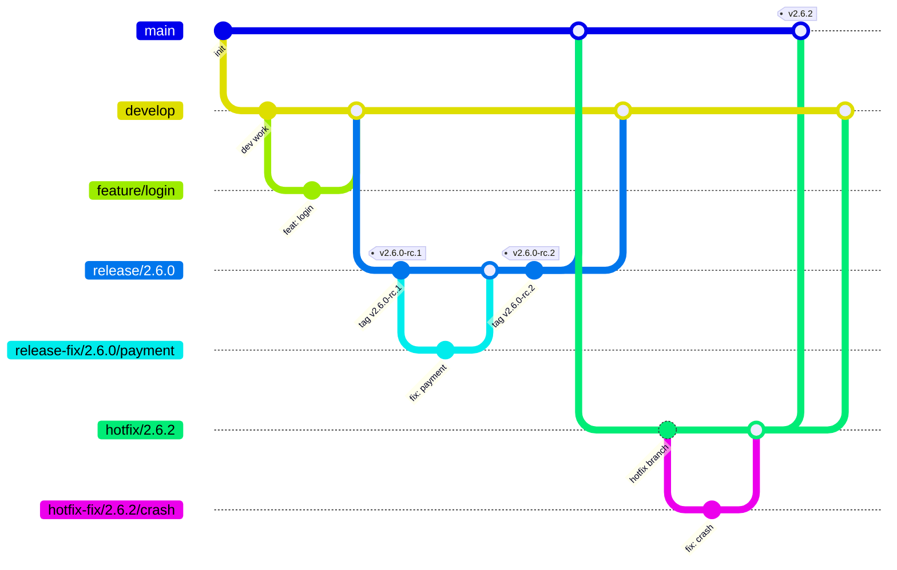
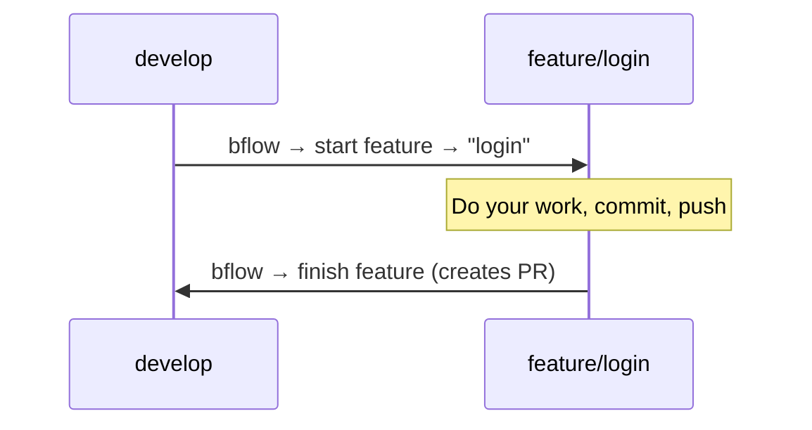
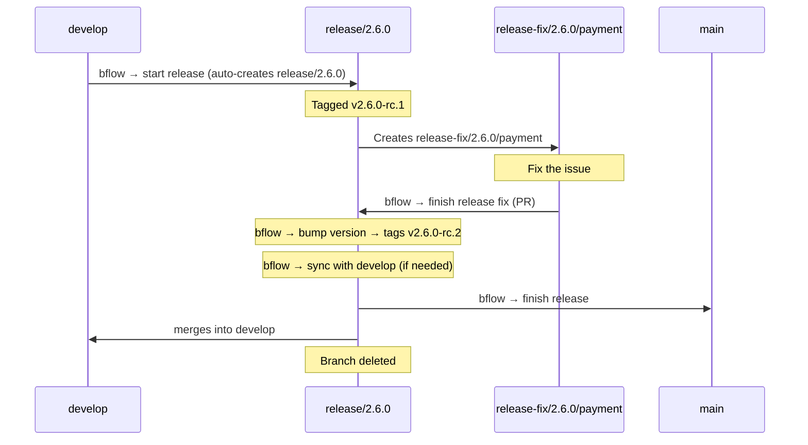
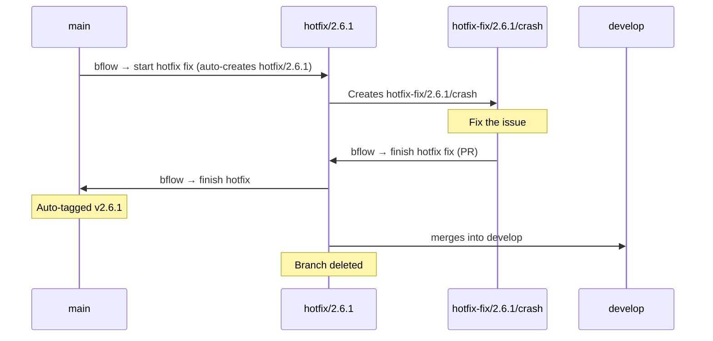
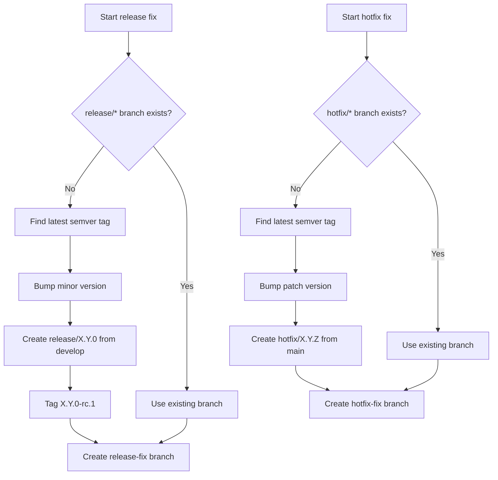
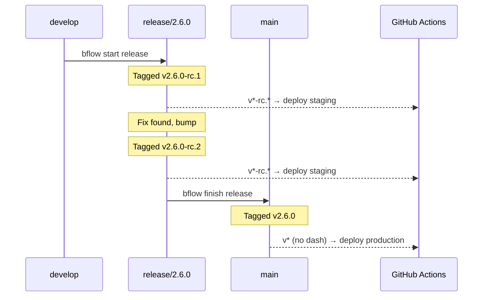

# bflow — Beans GitFlow CLI

A cross-platform CLI tool that implements the Beans customized gitflow workflow. It detects your current git branch, presents context-appropriate options, and handles all the branching, merging, tagging, and PR creation for you.

## Installation

### Homebrew (macOS)

```bash
brew tap Beans-BV/tap
brew install bflow
```

### Chocolatey (Windows)

```powershell
choco install bflow
```

### Pre-built binaries

Download the latest release from the [GitHub Releases](https://github.com/Beans-BV/beans-gitflow/releases) page.

### From source

```bash
cargo install --path .
```

### Requirements

- [git](https://git-scm.com/)
- [gh](https://cli.github.com/) (GitHub CLI, authenticated via `gh auth login`)

## Branch Model

bflow manages two permanent branches and several short-lived branch types:



### Branch Types

| Branch | Created from | Merges into | Purpose |
|--------|-------------|-------------|---------|
| `main` / `master` | — | — | Production code |
| `develop` | — | — | Integration branch |
| `feature/{name}` | `develop` | `develop` (PR) | New functionality |
| `fix/{name}` | `develop` | `develop` (PR) | Bug fixes |
| `chore/{name}` | `develop` | `develop` (PR) | Maintenance & tooling |
| `docs/{name}` | `develop` | `develop` (PR) | Documentation |
| `refactor/{name}` | `develop` | `develop` (PR) | Code restructuring |
| `release/{major}.{minor}.{patch}` | `develop` | `main` + `develop` | Release preparation |
| `release-fix/{v}/{name}` | `release/{v}` | `release/{v}` (PR) | Fixes during release |
| `hotfix/{major}.{minor}.{patch}` | `main` | `main` + `develop` | Urgent production fix |
| `hotfix-fix/{v}/{name}` | `hotfix/{v}` | `hotfix/{v}` (PR) | Fixes during hotfix |

## How It Works

Run `bflow` in any git repository. The tool detects your current branch and shows the appropriate menu.

### Uncommitted Changes

When you run `bflow start` with uncommitted changes (staged, unstaged, or untracked files), bflow automatically stashes your changes, creates the new branch, and restores them on the new branch. No flags or prompts needed — your work-in-progress follows you.

If restoring changes causes conflicts with the target branch, bflow leaves the conflicts for you to resolve manually (the stash is preserved as a safety net).

Finish commands (`bflow finish`, `bflow bump`, `bflow sync`) still require a clean working tree.

### On `develop`

```
? What would you like to do?
> start feature
  start fix
  start chore
  start docs
  start refactor
  start release
```

### On `main`

```
? What would you like to do?
> start hotfix fix
```

### On a work branch (feature, fix, chore, docs, refactor)

```
? What would you like to do?
> finish {type}
  start feature
  start fix
  start chore
  start docs
  start refactor
```

Selecting finish creates a PR back to the base branch. You can also start a new branch from the current branch or from `develop`.

### On `release/{v}`

```
? What would you like to do?
> finish release
  start release fix
  bump version
  sync with develop
```

### On `release-fix/{v}/{name}`

```
? What would you like to do?
> finish release fix
```

### On `hotfix/{v}`

```
? What would you like to do?
> finish hotfix
```

### On `hotfix-fix/{v}/{name}`

```
? What would you like to do?
> finish hotfix fix
```

## Non-Interactive CLI (for AI tools & scripts)

All commands can be invoked directly via subcommands, bypassing the interactive menu:

### Start commands

```bash
bflow start feature --name <name> [--base <branch>] [--no-checkout]
bflow start fix --name <name> [--base <branch>] [--no-checkout]
bflow start chore --name <name> [--base <branch>] [--no-checkout]
bflow start docs --name <name> [--base <branch>] [--no-checkout]
bflow start refactor --name <name> [--base <branch>] [--no-checkout]
bflow start release
bflow start release-fix --name <name> [--no-checkout]    # must be on a release branch
bflow start hotfix-fix --name <name> [--no-checkout]     # must be on main or hotfix branch
```

`--base` defaults to `develop` when omitted.

`--no-checkout` creates and pushes the branch without switching to it. You stay on your current branch. Designed for [git worktree](https://git-scm.com/docs/git-worktree) workflows. Not available for `start release`.

### Finish

```bash
bflow finish
```

Infers the action from the current branch type (e.g., creates PR on work branches, merges + tags on release/hotfix branches).

### Release-only commands

```bash
bflow bump    # bump patch version
bflow sync    # sync release into develop
```

Both require being on a release branch.

## Workflows

### Feature / Fix / Chore / Docs / Refactor

Simple workflow for day-to-day work:



### Release

Releases are tagged for deployment. Build agents auto-deploy based on tags.



#### Release commands

| Command | What it does |
|---------|-------------|
| **bflow bump** | Creates next RC tag (v2.6.0-rc.1 → v2.6.0-rc.2) |
| **bflow sync** | Merges release changes into `develop` for fixes needed immediately |
| **bflow finish** | Creates clean production tag (v2.6.0), merges into `main` + `develop`, cleans up branch |

### Hotfix

For urgent production fixes:



## Version Resolution

When starting a release-fix or hotfix-fix, bflow automatically resolves the integration branch:



## Commit Convention

All commits and PR titles generated by bflow follow [Conventional Commits](https://www.conventionalcommits.org/):

| Branch type | PR title format |
|------------|----------------|
| `feature/{name}` | `feat: {name}` |
| `fix/{name}` | `fix: {name}` |
| `chore/{name}` | `chore: {name}` |
| `docs/{name}` | `docs: {name}` |
| `refactor/{name}` | `refactor: {name}` |

Merge commits and tags also follow the convention:
- `chore: create release branch 2.6.0`
- `chore: bump version to v2.6.0-rc.2`
- `chore: release 2.6.0` (tag message for finish release)
- `chore: merge release 2.6.0 into main`
- `chore: merge release 2.6.0 into develop`
- `chore: sync release 2.6.0 with develop`
- `chore: merge hotfix 2.5.4 into main`
- `chore: hotfix 2.5.4` (tag message)
- `chore: merge hotfix 2.5.4 into develop`

## CI Integration

bflow uses **SemVer pre-release tags** to let CI systems distinguish staging from production deployments:

- **RC tags** (`v1.2.0-rc.1`, `v1.2.0-rc.2`) → staging/test deployments
- **Clean tags** (`v1.2.0`) → production deployments

This follows the convention used by Kubernetes, React, Node.js, Docker, and .NET.

### Tag Lifecycle



### GitHub Actions Setup

#### Staging (RC tags)

```yaml
name: Deploy Staging
on:
  push:
    tags: ['v*-rc.*']
jobs:
  deploy:
    runs-on: ubuntu-latest
    steps:
      - uses: actions/checkout@v4
      - run: echo "Deploying ${{ github.ref_name }} to staging"
```

#### Production (clean tags)

```yaml
name: Deploy Production
on:
  push:
    tags: ['v*']
jobs:
  deploy:
    if: "!contains(github.ref_name, '-')"
    runs-on: ubuntu-latest
    steps:
      - uses: actions/checkout@v4
      - run: echo "Deploying ${{ github.ref_name }} to production"
```

> **Why the `if` condition?** GitHub Actions tag patterns cannot exclude — `v*` matches both `v1.2.0` and `v1.2.0-rc.1`. The `if: "!contains(github.ref_name, '-')"` condition skips the job when the tag contains a hyphen (all RC tags do). The staging workflow doesn't need this because `v*-rc.*` only matches RC tags.

### Mobile Apps (Flutter, React Native)

Apple's App Store rejects version strings with hyphens — `CFBundleShortVersionString` only accepts `X.Y.Z` format. The RC tag is a **CI signal**, not the app version.

Your CI pipeline extracts the clean version from the tag and sets the build number separately:

```yaml
name: Deploy Staging
on:
  push:
    tags: ['v*-rc.*']
jobs:
  deploy:
    runs-on: ubuntu-latest
    steps:
      - uses: actions/checkout@v4
      - name: Extract version from tag
        run: |
          # Tag: "v1.2.0-rc.2" → version: "1.2.0"
          VERSION=$(echo "${{ github.ref_name }}" | sed 's/^v//' | sed 's/-.*//')
          echo "VERSION=$VERSION" >> $GITHUB_ENV
      - name: Build & deploy to TestFlight
        run: |
          flutter build ios \
            --build-name=$VERSION \
            --build-number=${{ github.run_number }}
          # TestFlight shows: "1.2.0 (47)"
```

**Traceability:** When a tester reports "bug on 1.2.0 (47)", check CI run #47 → triggered by tag `v1.2.0-rc.2` → `git show v1.2.0-rc.2` → exact commit.

## Architecture

```
src/
├── main.rs              — Entry point, preflight checks, dispatch
├── lib.rs               — Library root, re-exports all modules
├── git/
│   ├── mod.rs           — Git trait + CLI implementation
│   └── branch.rs        — Branch type detection and parsing
├── hosting/
│   ├── mod.rs           — Hosting platform trait
│   └── github.rs        — GitHub implementation via gh CLI
├── flows/
│   ├── start.rs         — Start work/release-fix/hotfix-fix
│   ├── finish_work.rs   — PR creation for work branches
│   ├── finish_release.rs — Bump, sync, finish release
│   └── finish_hotfix.rs — Finish hotfix with auto-tag
├── version.rs           — SemVer parsing and bumping
└── menu.rs              — Interactive menus via crossterm
```

The `Git` and `HostingPlatform` traits enable future extensibility (e.g. GitLab, Bitbucket) and testability.

## License

[Apache 2.0](LICENSE)
